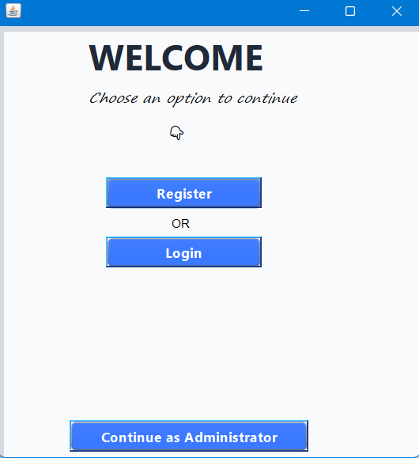
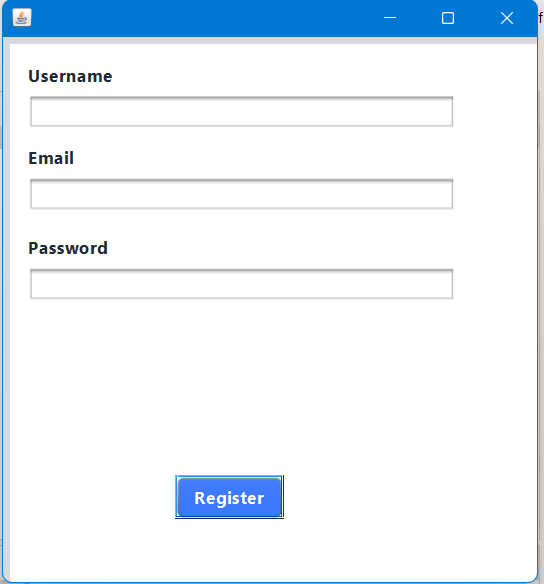
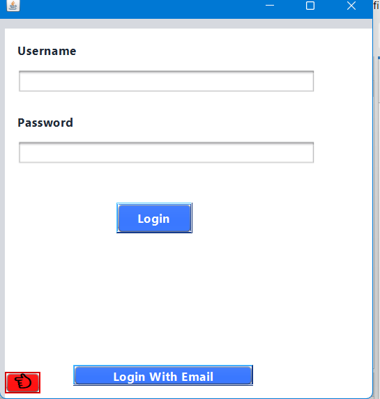
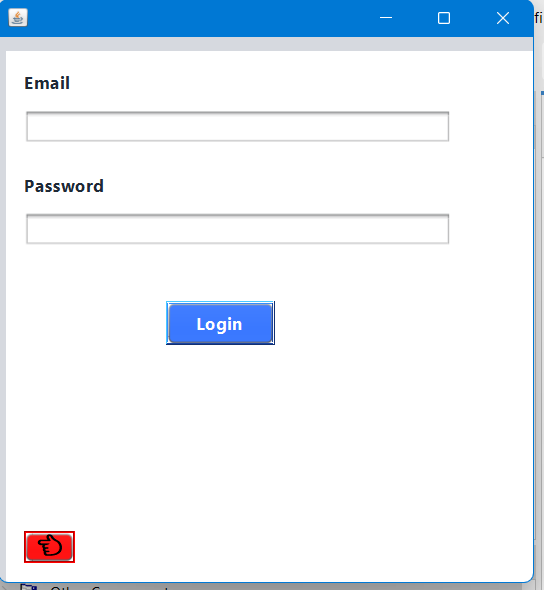
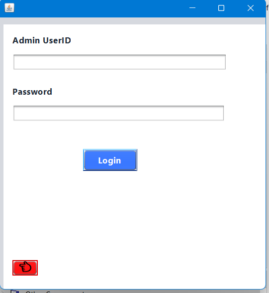
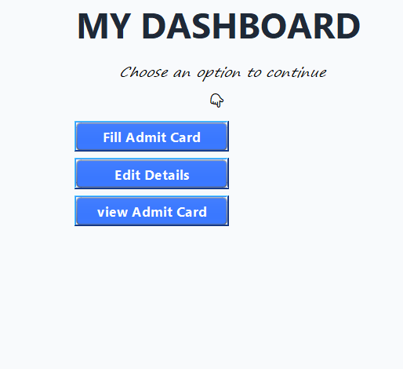
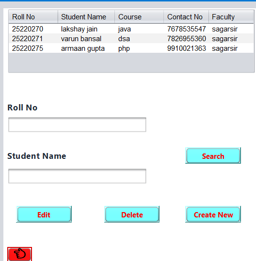
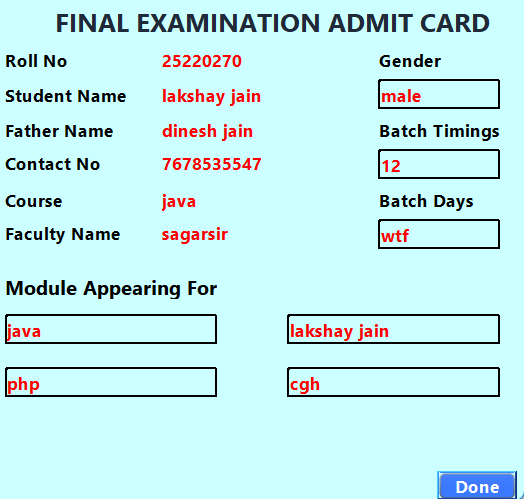
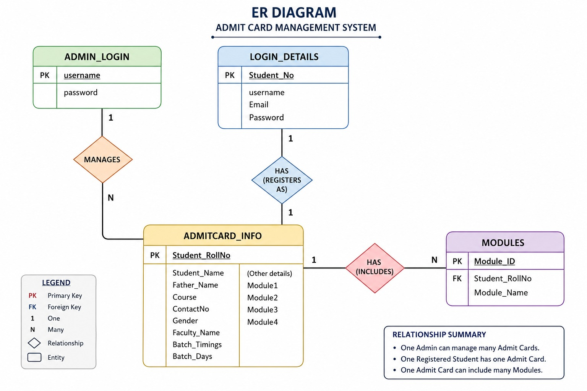

# 🎓 Admit Card Management System

A Java Swing Desktop Application developed using **Apache NetBeans**, **Java**, **JDBC**, and **MySQL** to automate the process of student registration, administrator management, and admit card generation.

This project was developed as my **first major Java project** during my B.Tech studies to strengthen my understanding of Java GUI development, database connectivity, and CRUD operations.

---

## ✨ Features

- 👨‍🎓 Student Registration
- 🔐 Student Login
- 👨‍💼 Administrator Login
- 📝 Generate Admit Cards
- 🔍 Search Student Records
- ✏️ Update Student Details
- 🗑️ Delete Student Records
- 📋 View Student Information
- ✅ Input Validation using Java

---

## 🛠️ Technologies Used

- Java
- Java Swing
- JDBC
- MySQL
- Apache NetBeans IDE
- XAMPP (phpMyAdmin)

---

## 📂 Project Structure

```text
AdmitCard
│
├── Database
│   └── admitcard.sql
│
├── images
│   ├── admin-login.png
│   ├── admin-view.png
│   ├── admit-card-view.png
│   ├── cover-page.png
│   ├── Dashboard.png
│   ├── ER-Diagram.jpeg
│   ├── login-page.png
│   ├── login-via-email.png
│   └── register-page.png
│
├── nbproject
├── src
├── test
│
├── .gitignore
├── build.xml
├── manifest.mf
└── README.md
```

---

# 🗄️ Database

This project uses **MySQL** as the backend database.

The SQL database file is available in

```text
Database/admitcard.sql
```

### Database Setup

1. Start **XAMPP**.
2. Start **Apache** and **MySQL**.
3. Open

```
http://localhost/phpmyadmin
```

4. Create a new database named

```sql
admitcard
```

5. Import

```
Database/admitcard.sql
```

6. Open `Connect.java`.

7. Update your database credentials if required.

8. Run the project from Apache NetBeans.

---

# 📸 Application Screenshots

## Welcome Screen



---

## Student Registration



---

## Student Login



---

## Login via Email



---

## Administrator Login



---

## Administrator Dashboard



---

## Admin Panel



---

## Admit Card View



---

## ER Diagram



---

# 🚀 How to Run

1. Clone the repository

```bash
git clone https://github.com/viplakshay-tech/Admit-Card_Management_System.git
```

2. Open the project in **Apache NetBeans**.

3. Start **Apache** and **MySQL** using **XAMPP**.

4. Create a database named

```sql
admitcard
```

5. Import

```
Database/admitcard.sql
```

6. Configure your MySQL username and password in

```
src/admitcard/Connect.java
```

7. Clean and Build the project.

8. Run `AdmitCard.java`.

---

# 📖 Learning Outcomes

Through this project, I learned:

- Java Swing GUI Development
- Event Handling
- JDBC Connectivity
- CRUD Operations
- Form Validation
- MySQL Database Design
- NetBeans GUI Builder
- Git & GitHub Project Management

---

# 🔮 Future Improvements

- Password Encryption
- QR Code on Admit Cards
- PDF Export
- Email Notifications
- Better Dashboard Analytics
- Multi-user Authentication
- Responsive UI Design

---

# 👨‍💻 Author

**Lakshay Jain**

B.Tech CSE (AI & ML)

GitHub:
https://github.com/viplakshay-tech

---

## ⭐ If you found this project useful, consider giving it a Star!